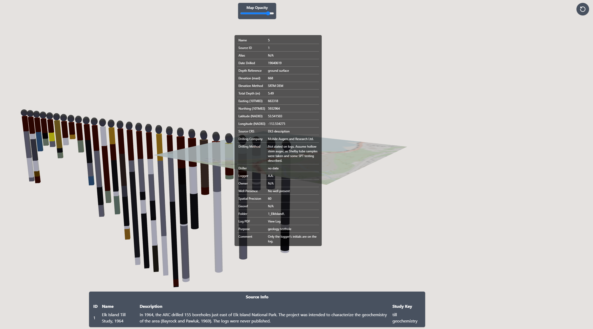
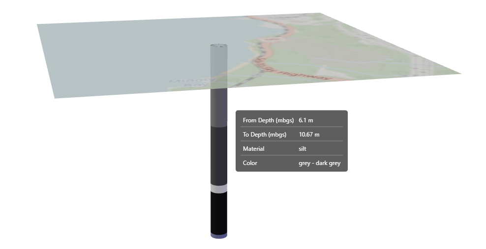

# react-three-next-demo

The goal of this app is to

* Learn and practice TypeScript, React.js, Next.js, React-three-fiber
* Display some sample borehole data positioned relative to a map, and with segments indicated
* Provide some interactions, at least some interactive data displays, maybe even networked sessions

## Progress

### Day 2

After being able to load a single borehole and display it with a tooltip, today my goal was to load multiple boreholes, display borehole metadata, and position them on the map. I was able to implement all of this except for the map positioning, as I ran out of time. The scope of this project is probably beyond what makes sense to fully learn the structure of React.js, Next.js, and r3f. However, thanks to ChatGPT, I was able to dive in quickly and learn by doing, and it has helped me to identify areas to focus on in terms of learning. Particularly managing state, context api, and JS data structures. It was also helpful to ask AI to compare React to Flutter, so I have an idea of how concepts translate (for example, props in React are like Widget properties in Flutter).

### Day 1

It's been challenging learning so many things at once and putting it all together. But I'm happy with the progress so far, after two days I have my app with the ability to load map textures for a given region, display them on a plane, set plane opacity with a slider, load sample borehole lithology data from a .csv file, and display it along with an interactive tooltip on hover.

## Sources

This project started with [`react-three-next`](https://github.com/pmndrs/react-three-next)

Sample Borehole data sourced from [`Open Government Canada`](https://open.canada.ca/data/en/dataset/4bf7cf6b-5ac8-4f66-bcff-3d3b56bb1df8/resource/19264868-ea19-4f63-9108-bf05e31869cc)

This project was bootstrapped with [`create-r3f-app`](https://github.com/utsuboco/create-r3f-app)
